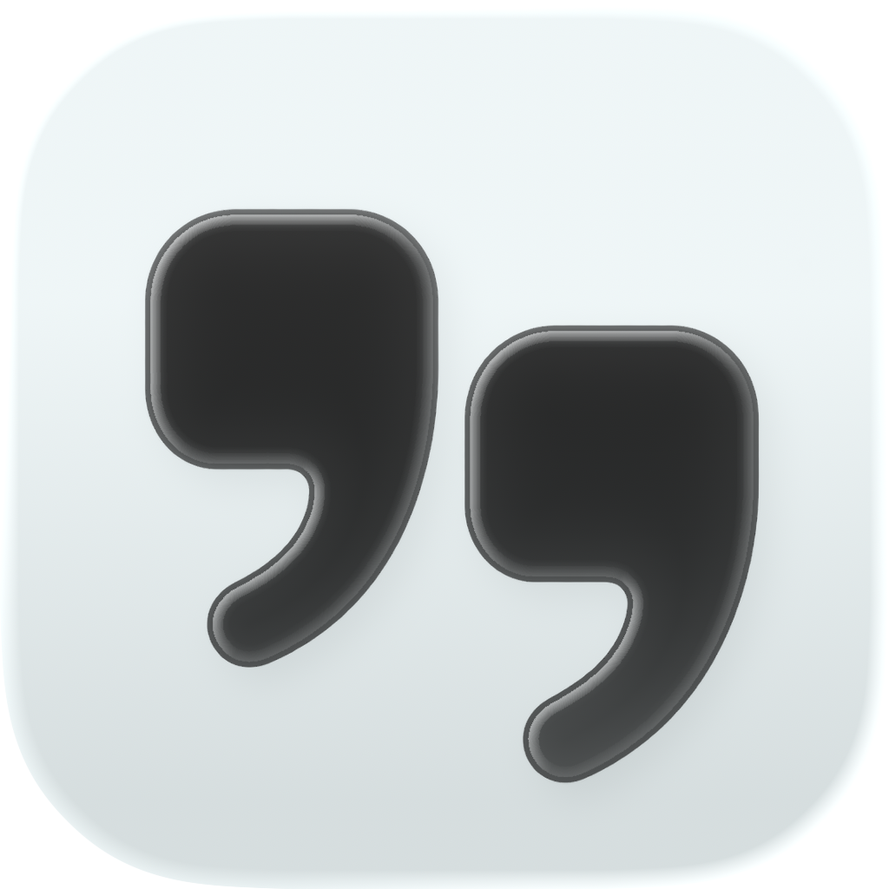
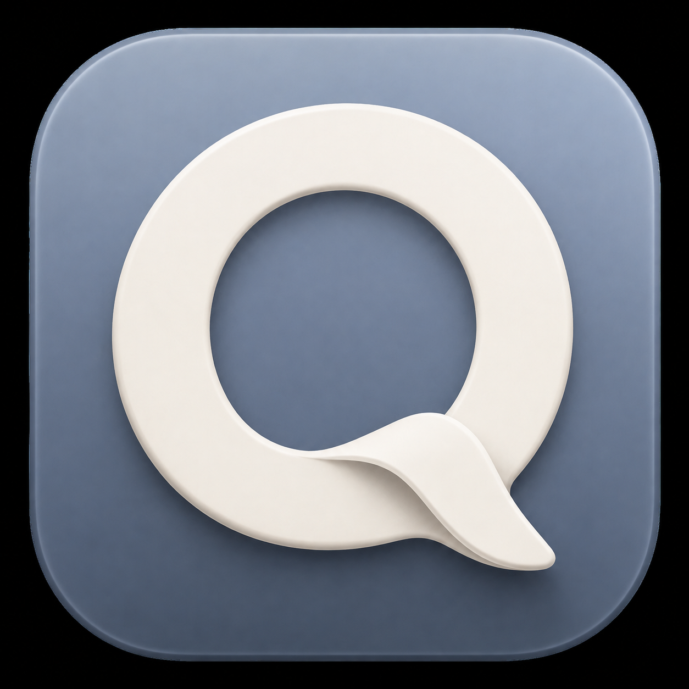

# Quibble icon direction

## Approved and integrated — build 29

On 2026-09-06 the user supplied Icon Composer exports and requested integration of the quotation-mark design. The matching original `/Users/march/Documents/Quibble.icon` was available beside the exports. It was copied intact into [the app’s resources](../../../App/Resources/Quibble.icon/icon.json), including its layer, position, materials, and appearance settings. Xcode uses `ASSETCATALOG_COMPILER_APPICON_NAME = Quibble` to compile it and generate the legacy fallback icon.

The source quotation layer also supplies the `QuibbleMark` template asset for the idle menu bar and setup-guide header. Recording retains its microphone state indicator. The original Documents files are untouched. Only the Default exported PNG was visually inspected; the native Composer source preserves the other appearances without flattening them into a static icon.

The earlier concepts and handoff below are historical. The quotation design is approved and integrated; no new design decision is pending. See [build 29 verification](../../../Benchmarks/BUILD-29-APP-ICON.md).

**Latest direction:** [Standalone logo explorations](../LogoExplorations/README.md). The user requested a reusable mark without an app-icon tile, for menu-bar and in-app branding as well as Icon Composer. The rendered tile below is retained as earlier concept history.

Prepared: **2026-09-06**. Apple guidance is directional after **2026-10-06**. **Concept only; awaiting the user’s choice.** No app icon has been installed or submitted, and no Icon Composer file is claimed complete.

## Recommended direction

A single ivory **Q / speech bubble** on muted slate-periwinkle. The loop connects to Quibble’s name, while its tail suggests conversation. It can represent dictation now and optional assistance later. This is a design judgment, not a claim from user testing.

The first generated render was too saturated and glossy. The current candidate keeps its silhouette with a calmer background and shallower porcelain finish. Treat the rendered depth as a mood reference: the final materials should be tuned in Icon Composer. The mark still needs small-size and monochrome evaluation, especially the folded tail.

Other directions worth considering if this does not feel right: a quotation-mark pair for a more editorial identity, or a sound stroke becoming a written line for a more functional identity. The Q is the recommendation because it gives Quibble a name-linked shape without restricting the identity to a microphone.

## User decision and Icon Composer handoff

1. The user approves the silhouette and palette, requests changes, or supplies a different design. This candidate is not automatically selected for the app.
2. Redraw the approved mark as editable vector artwork. Suggested construction: `01-SpeechLoop.svg` and, only if needed, `02-TailFold.svg`; simplify to one foreground shape if separate layers produce distracting highlights. Use a shared canvas and transparent surroundings.
3. Create the production `AppIcon.icon` in **Icon Composer**. Configure the background and material there. Do not import this flattened mockup as the finished layered icon.
4. Review Default, Dark, and Mono appearances; check the silhouette on light/dark surroundings at 16, 32, 64, 128, and large sizes. These sizes are a proposed QA checklist. Adjust optical weight, the tail, contrast, and depth based on actual previews.
5. Have the user approve the Composer result. Then integrate that source into Xcode, build, and inspect Dock, Finder, and app-switcher output, including the supported pre-Tahoe appearance. Export repository artwork from the approved Composer source.

## Apple guidance checked

| Guidance | Primary source | Read on |
| --- | --- | --- |
| Prepare separate SVG/PNG layers; prefer vectors for scalability. Use a 1024×1024 Mac canvas. Leave masks, background gradients, shadows, and transparency effects for the system/Composer workflow. | [Creating your app icon using Icon Composer](https://developer.apple.com/documentation/xcode/creating-your-app-icon-using-icon-composer) | 2026-09-06 |
| Composer supports a shared layered source with Default, Dark, and Mono appearances and adjustable material properties. | [Icon Composer](https://developer.apple.com/icon-composer/) | 2026-09-06 |
| Add the completed `.icon` to Xcode; the icon name in target settings must match. Xcode generates previous-system icon images from the Composer source. | [Creating your app icon using Icon Composer](https://developer.apple.com/documentation/xcode/creating-your-app-icon-using-icon-composer) | 2026-09-06 |

Apple’s [App icons HIG](https://developer.apple.com/design/human-interface-guidelines/app-icons) is the design reference to revisit during finalization. Its JavaScript page did not expose a readable body to the web reader in this pass; the linked Xcode guide’s first-party Markdown version and Icon Composer page supplied the workflow above. Icon Composer 1.6 is installed inside this Mac’s Xcode bundle, verified from its Info.plist on 2026-09-06; it has not yet been used to create this candidate.

## Files and provenance

- `quibble-speech-q-concept-v2.png`: built-in image-generation output, copied intact for review. Baked preview shading is not editable production material.
- [PROMPTS.md](PROMPTS.md): complete initial and revision prompts; built-in tool used, no CLI/API fallback.
- Production vector layers and the `.icon` project: pending the user’s design choice.

The icon decision and GitHub publication are separate. Publication still waits for the user’s explicit readiness instruction.
