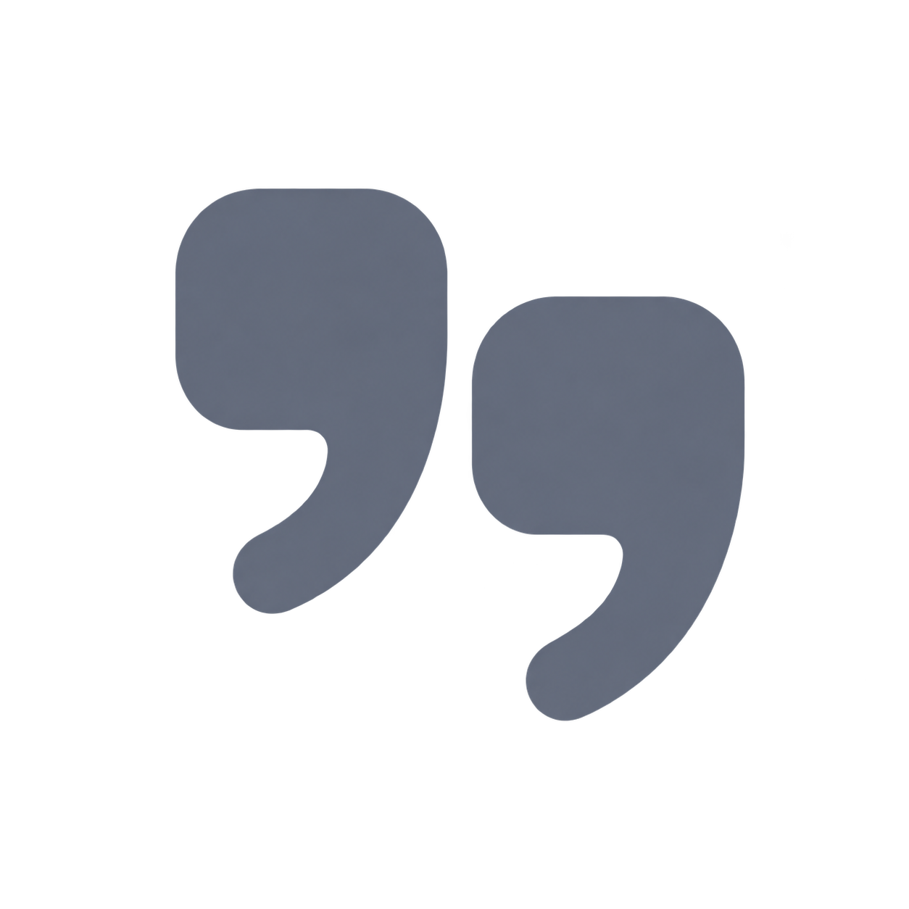
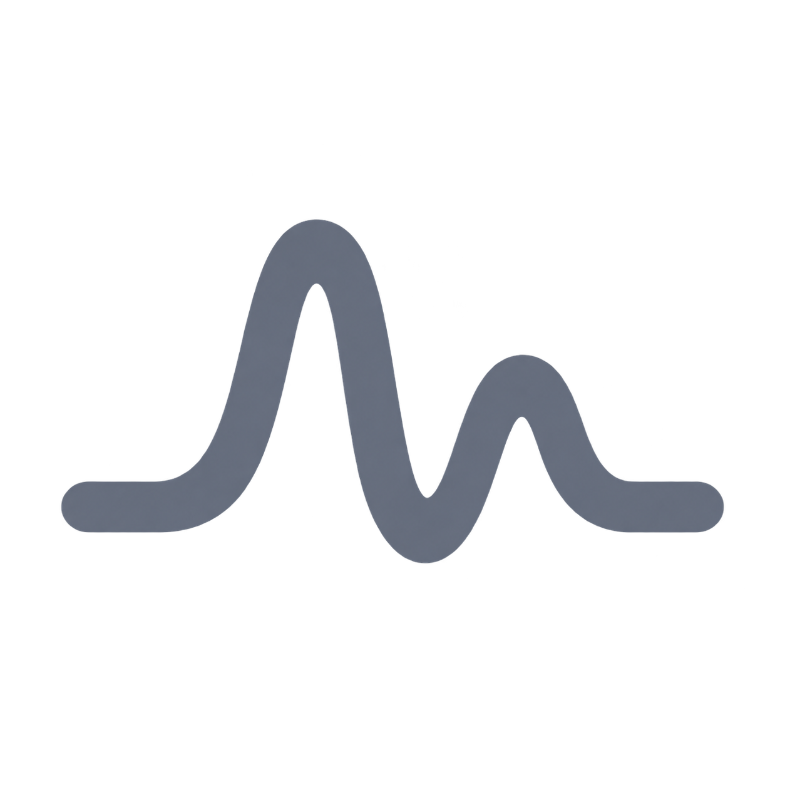

# Quibble — standalone logo exploration

**Decision:** the user selected **B · Quotation duet** and supplied a finished Icon Composer design. It is integrated in build 29; see [the production icon source and handoff](../AppIcon/README.md). The exploration notes below are retained as history.

2026-09-06 · **Awaiting the user’s choice.** These replace the previous app-tile treatment as the current exploration direction, not as installed branding.

Three separate marks, supplied as transparent PNG concepts. No enclosure, background plate, baked lighting, or app-icon effects. Each can be judged as a silhouette before choosing colors/materials in Icon Composer.

| A · Open Q | B · Quotation duet | C · Voice stroke |
| --- | --- | --- |
|  |  |  |
| A name-linked loop with an open tail. | Two offset quotation forms suggesting conversation. | Two unequal sound pulses settling into a line. |

My recommendation is **A** for its direct connection to Quibble and compact shape. **B** has a softer editorial character. **C** communicates sound most directly, but its wider footprint would need the most adjustment for small menu-bar use. These are design judgments, not user-test results.

## Next step after selection

Redraw the selected direction as clean vector paths, normalize its optical size and spacing, and review a true monochrome version at small menu-bar sizes. Produce a reusable vector master and an appropriate menu-bar template asset. The app icon then uses that mark as a foreground layer, with its background and materials finished in Icon Composer. Approval of a concept does not make these generated raster edges final production geometry.

The current app, menu-bar symbol, and icon assets are unchanged. The user decides what becomes the identity.

## Files

- [A — Open Q](01-open-q.png)
- [B — Quotation duet](02-quotation-duet.png)
- [C — Voice stroke](03-voice-stroke.png)
- [Complete prompts](PROMPTS.md): one built-in image-generation request per concept, no CLI fallback.
- [Asset metadata](assets.json): dimensions, alpha range, and SHA-256 hashes.

All three PNGs are 1254×1254 RGBA, with alpha ranging from 0 to 255 and transparent corners, checked directly on 2026-09-06. Files were copied intact from tool output; no background removal or image postprocessing was performed. Neutral gray is for comparison, not a committed brand color.

The [Icon Composer handoff](../AppIcon/README.md) still applies to the final app icon.
