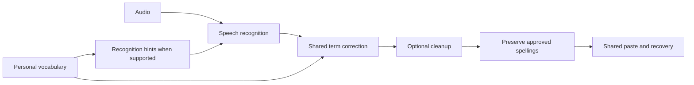

# Quibble: from working prototype to a dependable daily app

> Roadmap update, 2026-09-06: [Phase 2](PHASE-2.md) defines the next app-identity rules, opt-in context formatting, and optional assistant milestones. Local dictation stays independent; surrounding-text rewriting remains paused. This new plan supersedes the older sequence for that later scope without marking the prototype or release-hardening milestones complete. The [root README](../../README.md) describes the current app.

> Vocabulary status, 2026-09-05: the visual editor and explicit correction rules are implemented, but preferred-word-only recognition of uncommon names did not meet the user’s quality requirement. The universal vocabulary milestone remains open. The CPU measurements below describe the first implementation, not acceptance of that milestone. See [current evaluation](../../Benchmarks/VOCABULARY-QUALITY-EVALUATION.md).

Planned: 2026-09-05. Originally proposed after build 6; implementation was authorized in subsequent user messages. The original acceptance criteria remain below, with implementation updates tracked separately. It supersedes the sequence in [original research plan](RESEARCH-PLAN.md) where the two differ, while preserving the original long-term scope.

Implementation update, 2026-09-05: Build 8 integrates a scoped Whisper audio vocabulary helper with S1 ambiguity checks across all four ASRs. It improves tested name recovery while preserving the negative controls, but still misses several rare spellings. See [build 8 evidence](../../Benchmarks/VOCABULARY-AUDIO-BUILD-8.md). This remains an incomplete quality milestone, not production acceptance.

Implementation update, build 9: Home, grouped navigation, visual examples for the two supported modes, simplified vocabulary testing, and searchable text history are implemented. History supports original/final review, Copy, removal/undo, and opt-in local retention; session-only remains the default. The HUD adds detail text, reduced-motion handling, and a finish control. This is a bounded daily-use UX slice, not completion of guided setup, model management, or release hardening. See [verification and remaining work](../../Benchmarks/UX-BUILD-9.md).

Implementation update, build 10: the Models library now includes 13 model variants, named ordered workflows support optional/reordered vocabulary, cleanup and custom prompt steps, and a Developer tab exposes effective ASR controls and pipeline traces. A unified blurred window replaces mismatched materials and removes the fullscreen button. This expands model/mode capability; it does not close model repair, onboarding, broad quality evaluation or release validation. See [build 10 evidence and limitations](../../Benchmarks/WORKFLOWS-MODELS-BUILD-10.md).

Implementation update, build 11: a coordinated visual pass adds colored navigation, a one-time replayable tour, app icons and compact history, session model measurements, and a visual Diagnostics dashboard. Recognition accuracy remains unrated; weight precision is labeled separately. See [build 11 scope and checks](../../Benchmarks/VISUAL-UX-BUILD-11.md).

Implementation update, build 12: decorative colors are consolidated into a system-accent palette and native sidebar behavior. Models now show sourced upstream English WER, with quantization/runtime caveats, alongside local speed. See [HIG refinement and validation](../../Benchmarks/HIG-REFINEMENT-BUILD-12.md).

External facts checked 2026-09-05; treat them as directional after 2026-10-05. Product decisions and acceptance criteria below are proposed engineering choices, not measured performance promises.

## Product goal

Install Quibble, choose a shortcut, speak into an app, and get useful text. Add a name once and have that preference follow you when you change models. Understand recording, processing, delivery and recovery at a glance. Advanced model configuration should be available without being required for everyday use.

Keep transcription and processing local after downloads. Preserve existing signing identity and permissions during development updates. Voice commands remain part of the final version, after dependable dictation. Surrounding-text AI refinement stays paused until a separate quality gate is met.

## Starting point

Repository inspection: `App/DictationController.swift`, `App/TargetApplication.swift`, `App/GlobalShortcut.swift`, `App/VocabularyStore.swift`, `App/VocabularyView.swift`, `App/ModelLibrary.swift`, `App/ModelLibraryView.swift`, `App/QuibbleApp.swift`, `App/DictationFeedback.swift`, and `Inference/Sources/QuibbleInference/LocalInference.swift`, read from the working tree on 2026-09-05. There is no Git revision for this workspace; this section describes build 6, not immutable upstream code.

| Area | Current state | Production gap |
|---|---|---|
| Dictation and insertion | On-device ASR, S1 cleanup, hold-to-talk, HUD/sounds; shared paste path with recovery | Broader app/field coverage, keyboard layouts, device changes, sleep/wake and long-session validation |
| Vocabulary | Editable preferred terms; Qwen ASR receives hints; repeated-correction suggestions exist | Cohere/Parakeet ignore saved vocabulary; legacy aliases are hidden and inactive; no unified behavior |
| Feedback | Compact nonactivating HUD with actual audio level | Clearer visual hierarchy, recovery controls, accessible states, user placement preferences |
| Models | Local model selection and basic staged downloads | Reliable install/repair/resume, no manual path management, honest disk/RAM labels and lifecycle controls |
| Modes | Exact/basic available; S1 controls largely fixed | Useful previews and presets; model capability handling; clear vocabulary semantics |
| Recovery | Current transcript and global paste-last shortcut | Optional local history, visible delivery state, editing and undo flows |
| Release | Stable development signing; permissions retained in observed updates | Production location, migrations, clean-machine installation, distribution signing and updater validation |

Build 6 has 26 passing tests, user-confirmed working dictation, and a confirmed Notes insertion in Diagnostics. It does not establish universal app compatibility. See [phase 1 report](../History/PHASE-1.md) and `Benchmarks/CROSS-APP-INSERTION.md`.

## 1. Next milestone: vocabulary that works across speech models

This should be the next implementation slice, including its finished vocabulary UI. Do not start with a wholesale settings rewrite or re-enable app context.

### User experience

One Vocabulary screen with **Words**, **Corrections**, and **Suggestions** views. They share the same search and Add control; the distinction is understandable without knowing model internals.

- **Word:** `Superwhisper` — prefer this spelling when the utterance refers to it. This is guidance, not an instruction to insert the word into unrelated sentences.
- **Correction:** `super whisper → Superwhisper` — an explicit rule for a recurring mistake, with an editable list of observed variants.
- **Suggestion:** `Superwhisker → Superwhisper`, “You corrected this in two dictations,” with Add, Dismiss and Undo. Accepting a word should not silently authorize a broader replacement rule; show what will be saved.

Add a **Try it** area: record a short phrase, see original and final text with changed words highlighted, and see whether the entry helped. Offer Add from a selected transcript phrase. Support enable/disable, search, duplicate/conflict feedback, undo deletion, and import/export with a preview before applying entries.

Switching speech models must not switch vocabulary off. The product-level promise is that every supported model uses the shared vocabulary system; no model can guarantee correct recognition of every word in every recording.

### Shared processing behavior

1. Use native hints when the selected ASR adapter supports them. Bound and rank the hint list; avoid silently using only the first entries alphabetically. Start with explicit priorities and recent successful use; application-specific ranking can come later.
2. Apply approved literal correction rules through a common service available to all ASR models. Use whole phrases, predictable precedence and non-cascading edits. Preserve exact capitalization. Exclude accidental matches inside URLs and code identifiers; allow a user to create an explicit full-value rule when intended.
3. For preferred words without known aliases, retrieve plausible term candidates from the transcript. Evaluate a small local instruction-capable resolver that returns only proposed span replacements from the saved vocabulary. Validate ranges, expected original text and allowed replacement values. It must not generate a rewritten paragraph or add words with no matching span. An allowed replacement can still be semantically wrong, so validation is necessary but not sufficient.
4. Keep S1-mini for its supported cleanup job. The user-requested dictionary-prefix experiments are recorded in the quality evaluation; do not ship them unless preservation and correction tests qualify the format. Before shipping model-assisted vocabulary, measure whether a separate resolver is worth its latency and memory. Reuse an already loaded compatible model where possible; do not keep three large models resident by default.
5. Check that cleanup did not undo a resolved name or identifier. Use edit alignment to verify the specific occurrence, rather than applying a broad fuzzy replacement to the entire output. If cleanup damages protected terms or makes an uncertain change, use the corrected pre-cleanup transcript. Do not rely on untested placeholder tokens surviving S1.
6. If the resolver is unavailable or fails, retain the ASR output plus explicit approved corrections, and show that enhanced term matching was unavailable. No silent cloud fallback.

The model-assisted resolver is a benchmark decision, not a selected dependency. The first milestone is not complete merely because literal aliases work: preferred-word guidance must have an evaluated path on the default non-hint ASR too. If no local candidate meets the quality/latency bar, document the limitation and settle the model choice before claiming this requirement is delivered.

**Why not just ask S1?** Its publisher describes fixed normalization controls and explicitly says it does not follow general instructions. Vocabulary-specific instructions are not a documented input. [S1-mini model card](https://huggingface.co/superwhisper/s1-mini), read 2026-09-05. Superwhisper and Flow both distinguish vocabulary guidance from explicit misspelling corrections, which supports keeping those concepts clear in our UI. [Superwhisper vocabulary](https://superwhisper.com/docs/get-started/interface-vocabulary), [Flow dictionary](https://docs.wisprflow.ai/articles/4052411709-teach-flow-your-words-with-the-dictionary), read 2026-09-05.

### Mode semantics

Vocabulary should be an independent setting, enabled for normal dictation and cleanup, rather than tied to a model or tone preset. A minimal dictation mode keeps wording while applying vocabulary preferences; cleanup additionally normalizes the transcript. Keep **Raw ASR** as an explicitly advanced comparison mode that bypasses vocabulary hints, correction and cleanup. Do not label output “exact” while secretly modifying it. Explain the behavior during migration from the current Exact setting.

### Exit criteria

- The same enabled vocabulary is used by Cohere 4-bit, Cohere FP16, Parakeet and Qwen ASR, with cleanup both on and off.
- Approved literal correction fixtures produce the exact preferred spellings on every route. A separate preferred-word-only evaluation covers non-hint ASR.
- Positive and negative examples include names, acronyms, inflections, ordinary homophones, punctuation, Unicode and similar legitimate words. Include “May/Mae” and natural uses of “super whisper”; absence of the intended term must not invite replacement.
- Real microphone samples supplement synthetic fixtures. Compare vocabulary off/on, term recall, incorrect substitutions, unchanged meaning, latency and actual resident memory on the same recordings. Report results per model, not only an aggregate.
- Correction learning records user edits, never its own model changes as votes. Undo, repeated edits to one dictation and unrelated rewrites do not create false suggestions.
- Existing words/aliases migrate without loss or silently enabling old replacement rules. Import conflicts are previewed; export can be re-imported.
- The Try it view makes successful correction and unchanged output both understandable.

## 2. Make daily dictation and recovery feel finished

Deliver the HUD, quick controls and a simple recent-results view together.

- HUD states: listening with real level and elapsed time; processing; confirmed insertion; paste sent without confirmation; recoverable failure. Distinguish labels and symbols as well as color. Keep it nonactivating and off the text caret.
- Smooth transitions, restrained animation, matched short sound cues, reduced-motion support, high contrast and VoiceOver labels. Test light/dark appearances, multiple displays and full-screen apps.
- Show one clear recovery action where needed: Copy or Paste last. Require explicit retry after ambiguous delivery. A retry affordance must preserve or deliberately recapture the destination without stealing focus.
- Shortcut recorder with conflict feedback, configurable paste-last binding, push-to-talk and optional toggle recording. Microphone picker with a live level test and a clear disconnected-device state.
- Recent dictations with application icon, time, delivery state, raw/final comparison, Copy and vocabulary correction. Optional local history with a visible retention choice; existing users stay session-only until they opt in. Raw audio remains unsaved by default. Persist pending recovery only under the chosen retention policy; explain what survives restart.
- Test paste-blocked fields, then add an explicit typing compatibility option if needed. It must not run as an automatic second attempt after an ambiguous paste. Validate Unicode and keyboard layouts first.

**Exit criteria:** normal dictation needs no settings window; a failed delivery can be recovered without re-recording; no focus theft or duplicate insertion in the test matrix; each state is understandable without reading Diagnostics. Test native apps, Electron, browser textarea/contenteditable and a harmless terminal buffer. Include selection replacement, multiple paragraphs, undo, focus switches and clipboard changes.

## 3. Replace setup friction with guided setup and model management

- First run: explain local processing → microphone check → Accessibility/shortcut check → recommended model download → short practice dictation. Show download size before starting. Existing configured users skip completed steps.
- Default to an application-managed model directory under Application Support. Folder selection becomes an advanced option; support moving existing models without downloading again.
- Model cards show the speech/refinement distinction visually, selected/downloaded/loading state, download size, supported languages and relevant capabilities. Recommend a tested default pair. Speed/accuracy labels require measurements, with their hardware context; never imply FP16 is better just because it is larger.
- Separate **download size**, **current app memory**, and **diagnostic peak MLX allocation**. The current process-wide peak is not current memory usage. Add unload-after-idle and unload-now, measure cold/warm latency, and respond to memory pressure.
- Download progress with pause/resume where supported, cancel, retry, low-disk checks, integrity verification, interrupted-install recovery and Repair. Require a trusted pinned manifest and verify artifacts before marking a model ready; a nonempty file is not sufficient.
- Model switching must not overlap incompatible inference work, forget vocabulary, strand a partial download, or leave several large speech engines loaded unnecessarily.

**Exit criteria:** a clean user account can install and dictate without Xcode, Terminal or browsing model folders; interrupted downloads recover; corrupt artifacts cannot be selected as ready; a small-memory Apple Silicon machine is tested alongside this M5 Max.

## 4. Make modes useful and visual, then add application defaults

See the [Phase 2 contributor plan](PHASE-2.md) for the current identity-first implementation slice, reference-data boundaries, optional assistant transport decision, and acceptance gates.

- Preset cards with one sentence and a before/after example: minimal dictation, clean writing, casual messages, email and lists. Only offer transformations that the selected processing path supports.
- Each mode has a live Try it preview, vocabulary toggle, compatible processing settings, optional shortcut and reset-to-defaults action.
- Start automatic selection with **app identity only**: for example, choose a casual preset in a chat app. Manual selection wins. Show the active mode in quick controls so automatic behavior is visible and reversible.
- Do not assume every field in a code editor is code or every browser field is email. Allow an app default to remain minimal; add field/site rules only with reliable detection.
- Distinguish plaintext/Markdown bullets from native rich-text headings. Arbitrary custom instructions need an instruction-capable local model and their own evaluation.

**Exit criteria:** users can predict a mode from its example; switching apps does not duplicate surrounding text; names, numbers and negation survive formatting; unsupported controls do not appear as working features.

## 5. Release hardening and a small beta

Carry reliability checks through every milestone; this stage consolidates them for distribution.

- Separate dictation lifecycle, insertion/recovery, model lifecycle, vocabulary and persistence into services with explicit outcomes. Extend the existing insertion test seam; avoid an unrelated wholesale rewrite.
- Add versioned storage migrations, atomic writes and recovery from interrupted writes. Preserve vocabulary, preferences and opted-in history across updates. Keep diagnostics local and redact document/audio contents from support exports unless specifically included by the user.
- Validate sleep/wake, device disconnects, permission denial/revocation, repeated shortcut presses, cancellation, long dictations, model failures, low disk and memory pressure.
- Package a signed/notarized direct-download beta with model/runtime notices. Verify the exact distribution requirements and updater mechanism before implementing them. Development-to-distribution signing migration needs its own test; Xcode sign-in is not proof of permission continuity.
- Test a real signed update in the same installed location: microphone and Accessibility continue working, settings migrate, interrupted updates recover, and the old working version remains recoverable. Include login-item behavior if offered.
- Benchmark warm/cold release-to-insert latency, median and p95, current/peak memory, term correction quality and delivery outcomes. No claim that a single Notes success or unit suite establishes universal compatibility.

**Exit criteria:** clean install and signed update pass on a second machine; no known data-loss, wrong-field or duplicate-insertion regression in the agreed matrix; beta users can set up, dictate, customize vocabulary and recover errors without developer assistance.

## Visual direction across all milestones

Use the supplied Superwhisper screenshots for native spacing, hierarchy, sidebar organization and compact controls. Build Quibble's own consistent interface rather than reproducing a screenshot literally.

| Surface | Proposed presentation |
|---|---|
| Home | Ready state, shortcut keycaps, microphone status, selected mode, latest result; first-run checklist disappears when complete |
| Vocabulary | Inline add/search, word and correction rows, clear before → after, suggestion count, Try it panel |
| Modes | Visual preset cards with short examples and an editable preview |
| History | Compact chronological rows, app icons, delivery badges and highlighted changes; opt-in retention controls |
| Models | Comparable cards, progress, practical capabilities and clearly separated disk/memory information |
| Settings | Audio, shortcuts, appearance, privacy and updates; Permissions and Diagnostics nested here |
| HUD/menu bar | Minimal everyday controls and actionable recovery; detailed statistics remain in Diagnostics |

Keep typography, spacing, selection, focus rings, empty states and error styles consistent. Use progressive disclosure for model precision, file paths, benchmark exports and other advanced controls. Do not invent time-saved or accuracy statistics for a dashboard; add measured useful information only.

Before implementing each screen, review a small mockup showing its normal, empty, loading and error states. Then implement that vertical slice and test it in the running native app. Visual polish ships with functioning behavior at each step.

## Later scope, preserved

The context/assistant work below now has a dedicated [Phase 2 plan](PHASE-2.md). API and ACP remain alternatives to evaluate; an optional cloud assistant does not replace efficient local ASR or authorize background invocation.

- Surrounding-text context: separate opt-in experiment using narrowly bounded reference data. Must pass tests for copying old text, obeying instructions found in documents, inventing names and changing meaning before returning to ordinary modes.
- Voice commands: remain planned; distinguish commands from literal dictation and make behavior reviewable. Formatting commands before actions that send messages or execute commands.
- Broader language support and alternative platforms: evaluate independently rather than inferring support from one model's language list.
- Cloud accounts, sync, teams and billing are not required to make the local macOS app dependable.

## Recommended order and first handoff

**Vocabulary + its visual editor → daily HUD/recovery → onboarding/models/memory → visual modes/app defaults → distribution beta.** Reliability validation is part of every step, not postponed to the end.

The first implementation task should: (1) define vocabulary and mode semantics; (2) build a small cross-model positive/negative corpus and evaluate the fallback resolver; (3) implement one shared vocabulary service; (4) ship the Words/Corrections/Suggestions editor and Try it preview; (5) verify all supported model routes before proceeding. If fallback quality or latency fails, resolve that decision before calling vocabulary universal. No calendar estimate is assigned until this evaluation sizes the work.
