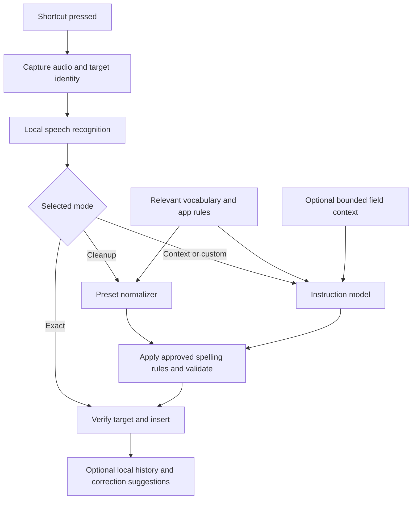

# Local-first dictation: feasibility and proposed plan

Next-work sequence after build 6: see [production plan](PRODUCTION-PLAN.md), planned 2026-09-05. It updates the vocabulary approach and product milestones while preserving this document's original scope and research history.

Retrieved: 2026-09-05. Directional after: 2026-09-19; recheck model capabilities, licenses and runtime support before implementation.

Status: phase 1 implementation authorized on 2026-09-05 and underway. See the phase 1 report for actual build and benchmark evidence; the research below remains a proposal, not a claim that all features exist. Platform: macOS on Apple Silicon; English first for the prototype, pending broader language requirements. All feasibility ratings, architecture choices, targets and phases below are engineering judgments, not measured results or vendor guarantees.

## Answer

The product is plausible. Editable vocabulary, local transcription, shortcut recording and preset formatting are strong initial features. Reading arbitrary applications and recognizing subsequent corrections require capability checks and a tested compatibility list. The proposed model pairing exists, but the small cleanup model cannot supply arbitrary context-aware instructions.

Superwhisper already documents vocabulary, replacements, application context and custom modes. A useful product distinction would be an editable, explainable learning process, precise application rules and dependable local operation, rather than those features individually. [Vocabulary](https://superwhisper.com/docs/get-started/interface-vocabulary), [custom modes](https://superwhisper.com/docs/modes/custom). Read 2026-09-05.

## Feature assessment

| Feature | Plausibility | Proposed behavior and limit |
|---|---|---|
| Editable personal vocabulary | High | Local entries with preferred spelling, aliases, language and optional application scope; search, edit, disable, import and export. Distinguish recognition hints from explicit replacements. Hints depend on the ASR engine; replacements can work independently. |
| Suggestions from repeated corrections | High inside our editor; conditional in other apps | Compare original output with user edits, accumulate repeated phrase corrections and ask whether to save them. External observation requires readable fields and supported notifications; do not promise universal learning. |
| Identify active application | High | Capture app identity when recording starts; map it to user-editable defaults. Browser identity alone cannot identify the website or distinguish a message box from a search box. |
| Read nearby or selected text | Conditional | Collect only a bounded amount from supported Accessibility elements. If unavailable, continue with app identity or a manually selected mode. |
| Email formatting | High | Paragraphs, greeting/sign-off spacing and a formal preset. Preserve intended content; do not invent a recipient, commitment or signature. |
| Chat formatting | High | Conversational punctuation and short paragraphs. Treat summarization or removal of substantive content as a separate explicit instruction. |
| Code-editor formatting | Moderate | Start with technical prose and exact preservation of known identifiers. Generating syntactically correct code and editor-specific indentation is a separate feature. A code editor also contains chat, comments and terminals; app name alone is insufficient. |
| Notes formatting | High for plain text; conditional for native rich text | Paragraphs and text/Markdown bullets first. Semantic headings require an instruction-capable model or explicit commands; native heading styles need application-specific insertion support. |
| Exact transcription | High as an unrefined ASR mode | Preserve ASR output; bypass cleanup and replacements by default. “Exact” cannot promise perfect verbatim capture: ASR can still omit, normalize or misrecognize speech. |
| Basic cleanup | High | Optional filler removal, punctuation and constrained formatting with raw output available for recovery. |
| Context-aware AI refinement | Plausible; quality-sensitive | A separate instruction-capable model receives bounded context, relevant terms and a narrow rewrite instruction. Check for changed meaning and vocabulary regressions. |
| Custom formatting instructions | Plausible; model-dependent | User instructions plus preview examples and per-mode engine selection. Expose only supported controls when using the small fixed-function normalizer. |
| Press, speak, release, insert | High across tested applications | Recording state machine, focus tracking, insertion fallback and recovery. Measure final insertion delay, including model loading and refinement. |
| Fully local operation | High for downloaded compatible models | Keep audio, context, vocabulary and inference on-device. Initial model downloads are distinct from inference. Make any future cloud route explicit and optional. |

The platform basis is Apple's [frontmost application API](https://developer.apple.com/documentation/appkit/nsworkspace/frontmostapplication), [Accessibility element API](https://developer.apple.com/documentation/applicationservices/axuielement) and [observer API](https://developer.apple.com/documentation/applicationservices/1462089-axobserveraddnotification), which can report unsupported notifications. These enable conditional integration, not a universal application contract. Read 2026-09-05.

## Model findings

**Cohere Transcribe is a real local candidate.** The March 2026 model has 2B parameters, an Apache 2.0 license and 14 supported languages. Cohere documents offline inference and links an Apple Silicon MLX runtime. Its card describes chunked audio and punctuation controls; native streaming microphone recognition and custom vocabulary prompting were not confirmed. The model download is currently gated. [Official model card](https://huggingface.co/CohereLabs/cohere-transcribe-03-2026). Read 2026-09-05.

Cohere says language must be specified and does not provide native timestamps or speaker diarization. Those omissions are manageable for short dictation, though language switching needs its own evaluation. [Cohere documentation](https://docs.cohere.com/docs/transcribe). Read 2026-09-05. Rough parameter arithmetic puts BF16 weights near 4 GB before runtime overhead; this is an estimate, not a measured RAM requirement. Quantization must be benchmarked for both memory and recognition quality.

**S1-mini fits preset cleanup.** Its v1 release is English-only, approximately 0.6B parameters, with a roughly 462 MiB quantized build. It is not a general instruction follower. The documented controls select tone, prose/lists and general/email layout; its exact prompt format and disabled thinking are required. Arbitrary field context and user instructions are outside that interface. [Model card](https://huggingface.co/superwhisper/s1-mini). Read 2026-09-05.

The license adds a naming requirement identifying the model as “S1-mini” by “Superwhisper”; it should not be described as unmodified Apache 2.0. Preserve the applicable notices when distributing it. [License](https://huggingface.co/superwhisper/s1-mini/blob/main/LICENSE). Read 2026-09-05.

Superwhisper itself recommends local Cohere Transcribe plus S1-mini. That establishes product precedent, not performance for our future implementation. [S1 announcement](https://superwhisper.com/blog/s1). Read 2026-09-05.

**Comparison candidates, not selected dependencies:** include [NVIDIA Parakeet TDT 0.6B v3](https://huggingface.co/nvidia/parakeet-tdt-0.6b-v3) as a smaller ASR candidate; its card lists 25 European languages and CC BY 4.0. Include [Qwen3-4B-Instruct-2507](https://huggingface.co/Qwen/Qwen3-4B-Instruct-2507), an Apache 2.0 instruction model, for richer local refinement. Read 2026-09-05. Evaluate a Whisper-family baseline as well, but finalize its runtime and model revision during the prototype. Avoid selecting any model solely by published aggregate accuracy or throughput.

## Proposed architecture

Vocabulary and application rules around the preset normalizer are application logic; the diagram does not imply injecting unsupported prompts into S1-mini. ASR recognition hints are a separate optional capability where the chosen engine supports them.

Proposed stack: native Swift/SwiftUI settings with AppKit and Accessibility integration, a local persistent vocabulary store, and replaceable speech/refinement engine adapters. Benchmark a compatible MLX runtime for Cohere and a GGUF runtime for S1-mini. Pin and audit the actual runtime/model artifacts after selection. Keep inference work off the UI thread and give each recording a cancellable session identifier.

At shortcut-down, record the application, focused element and available selection without moving focus. Start microphone capture promptly; context collection must not delay recording. At release, finalize transcription and run only the selected processing path. Before insertion, revalidate the target and selection. If focus or content changed ambiguously, retain the result for manual insertion instead of writing into a different field.

Use Accessibility insertion where the correct attribute is writable and replacement semantics are understood. Otherwise use a controlled clipboard/paste path. Restore previous clipboard content only when it is still safe to do so; never overwrite a newer user copy. Do not retry an uncertain insertion automatically and risk duplicates. Supply Copy and retry controls, and never submit/send the destination form.

Context priority: explicit user mode override, then field/site rule when available, then application rule, then default. Treat captured text as reference data, not instructions. Cap its size; do not collect entire windows by default. Start without screenshots, OCR or browser extensions. Add those only if a measured compatibility gap justifies them.

## Vocabulary and learning design

Represent an entry as a preferred spelling plus optional known misrecognitions, language, application scope, enabled state and source (manual or accepted suggestion). Keep observed suggestions separate from approved entries. Let users inspect why an entry was suggested, undo acceptance and suppress an unwanted suggestion.

Example: repeated edits of `super whisper` to `Superwhisper` create a candidate mapping. Start with a provisional threshold of three consistent corrections in separate dictations; tune it using actual errors. Do not silently save it. A mapping such as `May` to `Mae` needs narrower scope because both forms can be correct.

Use whole-word/phrase matching, longest-match precedence and predictable conflict handling. Do not perform unrestricted substring replacements inside URLs, code or unrelated words. Retrieve a small relevant vocabulary subset for capable models instead of sending the entire dictionary. Apply or check approved spellings after refinement so a model cannot undo the preference unnoticed. Preservation checks should include names, identifiers, numbers and negation; simple rules cannot prove semantic equivalence.

First collect corrections in our own history/editor, with retention under user control. Later, opt-in external learning can watch the most recent inserted span in supported apps for a short interval. Stop on ambiguous focus changes, field destruction or unrelated editing. An Accessibility change is evidence of an edit, not proof of a transcription correction. Learning here means updating local data, not retraining model weights.

## Platform and distribution

Apple exposes key press/release events and microphone authorization APIs. Plan microphone and Accessibility onboarding, plus Input Monitoring if the shortcut implementation needs it. Test permission denial, lost shortcut release, sleep/wake and audio-device changes. [Keyboard events](https://developer.apple.com/documentation/coregraphics/cgeventtype), [microphone authorization](https://developer.apple.com/documentation/avfoundation/requesting-authorization-to-capture-and-save-media). Read 2026-09-05.

Apple lists assistive use of Accessibility APIs among App Sandbox restrictions and requires sandboxing for Mac App Store distribution. Therefore the proposed full-feature version should begin as a Developer ID signed, notarized direct download. This is an architectural recommendation; an App Store version would need a separate capability assessment. [Apple sandbox guidance](https://developer.apple.com/documentation/security/protecting-user-data-with-app-sandbox), [notarization](https://developer.apple.com/documentation/security/notarizing-macos-software-before-distribution). Read 2026-09-05.

Exclude secure/password fields from context and learning, with per-app exclusions and a visible context toggle. Keep history optional; raw audio should not persist by default. Disable network inference in local-only mode rather than silently falling back to a provider. Test this after initial model installation with network access disabled. Windows or Linux would need separate shortcut, permissions, context and insertion implementations; shared models do not make those integrations portable automatically.

## Build sequence and decision gates

Accepted requirements added 2026-09-05: preserve permissions through app updates by maintaining stable signing identity and bundle identity; verify with successive signed builds and an actual permission-retention test. Xcode sign-in alone is insufficient evidence. Voice commands remain in the final-version scope, after reliable dictation and customization; the prototype must not interpret dictation as executable commands.

1. **Feasibility prototype.** Establish target hardware/languages. Benchmark candidate ASR engines and S1-mini; test capture, focus and insertion in representative apps. Exit when latency, memory, language coverage and insertion reliability support a defensible first-version scope.
2. **Useful local dictation.** Implement push-to-talk plus a toggle alternative, recording feedback/cancel, raw and cleanup modes, model download/status, manual vocabulary, optional history and copy/recovery. Exit when offline dictation and correction rules behave predictably in the tested app set.
3. **Application presets.** Add per-app rules and manual overrides; email/chat/note/technical-prose defaults. Start with identity-based preset selection, then optional selected/nearby text. Exit when missing context degrades cleanly and focus changes cannot misdirect insertion.
4. **Learning suggestions.** Add corrections in our history editor first, then bounded external observation for compatible fields. Exit when suggestion precision is acceptable and all accepted changes remain editable and reversible.
5. **Advanced customization.** Add a separate instruction model, custom templates, richer context and application-specific adapters. Exit when the added capability justifies its measured latency and meaning-preservation tradeoffs.
6. **Release preparation.** Package signed/notarized builds, verify licensing notices, model updates/download recovery and onboarding. Expand the compatibility matrix before making broader support claims.

Later milestone: opt-in voice commands with an explicit command mode, a defined command set, cancellation/undo where possible, and confirmation for consequential actions. Command recognition must remain separate from ordinary dictation. Scope examples and priorities are to be decided after the dictation milestones.

The supplied SuperWhisper PNGs cover home, modes, vocabulary, history, configuration and model settings. They are reserved as visual references for the build stage. Proposed settings groups: General/Shortcut, Speech Models, Modes, Applications/Context, Vocabulary/Suggestions, History and Privacy. Final navigation should follow the validated product scope.

## Prototype evaluation

Use the same 5-, 15-, 30- and 60-second recordings across engines. Include names, technical terms, numbers, negation, spoken corrections, short commands, noise and silence; add each required language/accent and mixed-language case explicitly.

Measure cold load, warm ASR, refinement and release-to-insert p50/p95 separately, plus peak memory and sustained power/thermal behavior. Proposed initial target: on a named baseline Apple Silicon machine, warm 5–15-second English dictations in cleanup mode should aim for p50 under one second and p95 under two seconds after release. These are aspirational product gates, not current performance claims. Report richer custom-mode latency separately.

Compare raw ASR, ASR plus vocabulary, and ASR plus refinement. Track word error rate, preferred-term recall, unwanted replacements, omissions, altered numbers/negation and user correction effort. Test dictionary sizes of 0, 50, 500 and 5,000 entries with selective retrieval. Avoid assuming a throughput benchmark predicts short-utterance responsiveness.

Proposed compatibility matrix: TextEdit, Apple Mail, Slack, Notes, a code editor, browser textarea and rich contenteditable fields, with app/browser versions recorded. Exercise partial selection, Unicode, undo, clipboard races, changed focus, unavailable Accessibility, secure fields and a model timeout. No tested app names should be published until those checks actually run.

## Unconfirmed and open decisions

| Question | Evidence checked / next step |
|---|---|
| Final platform and hardware floor | macOS Apple Silicon is an assumption; specify baseline Mac and RAM before benchmarking. |
| Required languages | S1-mini v1 limits the full cleanup path to English. Specify other languages before choosing a replacement or bypass behavior. |
| Cohere hotwords and true audio streaming | Not established by official card/docs reviewed; inspect selected runtime and test explicitly. Token-output streaming is not proof of incremental audio support. |
| Actual latency, RAM and battery cost | Initial local synthetic benchmarks completed; see `Benchmarks/FINDINGS.md`. Human speech, a slower hardware baseline, quantization comparisons and battery cost remain open. |
| Which apps expose editable text and corrections reliably | API support does not establish individual compatibility. Execute the proposed matrix. |
| Runtime revision and distributable model bundle | Final runtime versions, conversions, download flow and full redistribution obligations remain a pre-build/release check. |
| Cloud policy | Default recommendation is fully local processing; any optional cloud engine requires an explicit user-controlled mode. |
| Schedule | Do not commit to calendar estimates until phase 1 resolves runtime and insertion risks. |

This plan recommends beginning with the feasibility prototype when building is requested.
