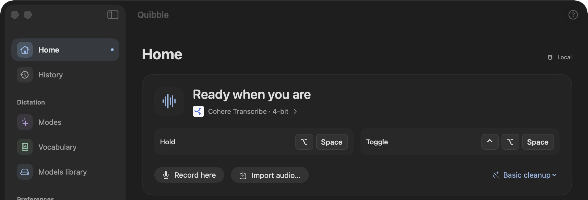
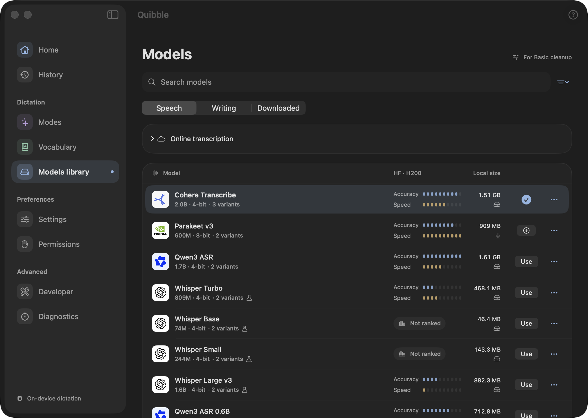
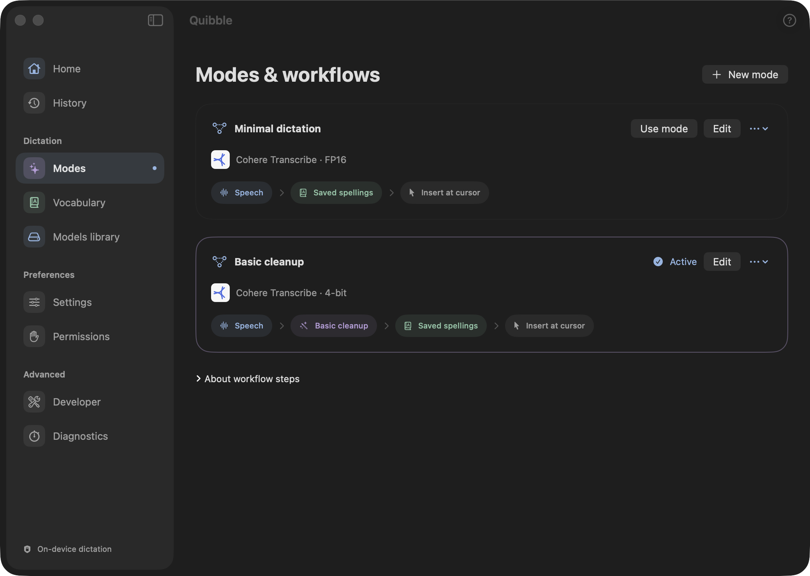
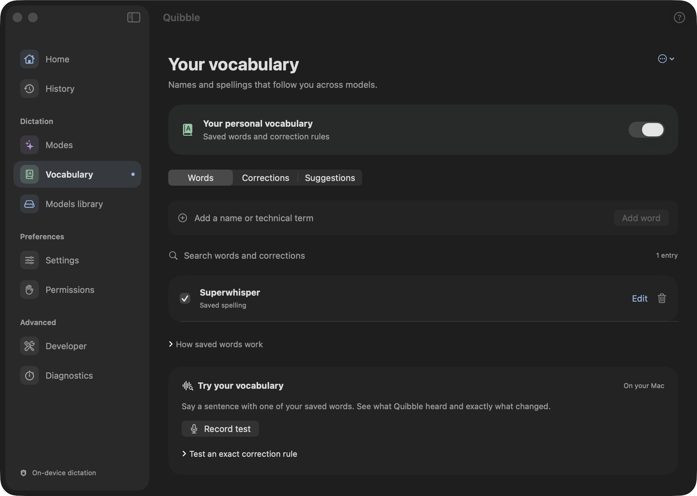

# Quibble


Dictation for your Mac, with local speech recognition, personal vocabulary, and writing modes you can shape around your work.

Hold a shortcut, speak, and release to insert the result in the current text field. Prefer hands-free recording? Press the toggle shortcut once to start and again to finish. A floating HUD shows listening, processing, delivery, and no-speech states.



**Status:** an actively developed, signed macOS application. It is usable for local testing, but is not yet a packaged, notarized public release. Context-aware assistants and voice commands are future work.

## What it does

- **Local or online transcription.** Run Cohere, Parakeet, Qwen3 ASR, Whisper, Canary, Nemotron, Moonshine, or Granite on Apple Silicon. New artifacts carry their current validation status in Details. OpenAI transcription is an explicit alternative with your own API key.
- **Personal vocabulary.** Save names and preferred spellings, review suggested corrections, and test them with your voice. A shared audio helper checks saved terms for local speech models; optional exact rules handle recurring substitutions.
- **Editable modes.** Choose a speech model, add or skip saved spellings, cleanup, and custom-prompt steps, then insert the result or keep it in Quibble for review.
- **Cross-app insertion and recovery.** Paste into the captured destination, keep a copy when delivery cannot be confirmed, and use a separate shortcut to paste the last transcript.
- **Useful history.** Search text, compare original and final output, see source-app icons, speaking pace, and a timestamped timeline. Optional online speaker labels distinguish voices.
- **Controls when you need them.** Selective model downloads, independent HUD layout/material settings, editable shortcuts, per-stage diagnostics, and supported ASR controls in Developer.

| Models library | Modes and workflows | Vocabulary |
| --- | --- | --- |
|  |  |  |

Screenshots are from a development build on macOS 26.6.1; see [Docs/Screenshots](Docs/Screenshots/README.md).

## First dictation

Open **Setup guide** from the question-mark button in Quibble’s toolbar. Its four sections cover access, models, a practice recording, and personalization. You can explore while models download: progress stays visible across sections, and closing the guide keeps downloads running while Quibble is open. **Resume setup** on Home returns an unfinished setup to the saved section.

1. Allow **Microphone** access to record. Allow **Accessibility** and enable the global shortcut to dictate into other apps. macOS owns these permission controls.
2. In **Choose a model**, select a speech model and optionally add S1-mini cleanup. **Download models** queues only missing components for the selected mode, showing received bytes, measured transfer speed, and connecting/checking states. A stalled transfer shows how long it has waited for data. Cancel stops the remaining downloads and keeps completed components.
3. Hold your real shortcut, speak, and release while **Try your voice** is focused. The animated keycaps depress, the illustration follows actual recording and processing, and your completed transcript appears. After a short reading pause, the demonstration resumes using your words as a clearly labelled replay. A recording button works for practice before global shortcuts are ready. Then try the shortcut in another app’s text field.
4. **Make it yours** links to Vocabulary, Modes, Settings, and History. Add a few names and adjust your workflow when you need more than plain dictation.

The guide offers three starting points: Cohere Transcribe, Qwen3 ASR, and the smaller Whisper Turbo. It suggests a weight format using the Mac’s memory and the mode’s other models. Existing choices and downloads are preserved; returning to the guide does not reset your setup.

| Action | Default shortcut |
| --- | --- |
| Hold to dictate; release to finish | Option–Space |
| Press to start; press again to finish | Control–Option–Space |
| Cancel a shortcut recording | Escape |
| Paste the last transcript at the current cursor | Control–Command–V |

The quotation-mark icon in the menu bar opens **Transcribe File…**, **History**, and **Settings…**, and lets you select a microphone or writing mode. **System Default** follows the Mac’s input at the start of each recording; choosing a specific microphone affects only Quibble. Input and mode changes are disabled during dictation.

Change the three dictation/paste bindings in **Settings**. The in-app recording button and audio-file import keep their result inside Quibble. Global dictation follows the selected mode’s destination.

Shortcut checks warn about matching enabled macOS shortcuts and supported Raycast settings. macOS does not expose every app’s bindings; Raycast 2 keeps its setting private, so Quibble reports that coverage gap. Existing bindings are never reassigned automatically. See [shortcut detection and limits](Benchmarks/SHORTCUT-CONFLICTS-2026-09-06.md).

There is no one-minute recording cutoff. Longer input is processed sequentially in sections of at most 60 seconds. Transcription begins after recording finishes; the HUD visualizer is live audio feedback, not a partial transcript.

If a destination cannot confirm the paste, check its contents before using Paste Last. Quibble does not retry automatically or press Enter to submit. Secure fields are excluded; some editors provide less reliable accessibility information than others.

## Models and modes

The **Models** library has one entry per model, with weight formats in **Details**. Q4/Q8 suggestions prefer variants with recorded smoke tests and leave room for macOS and writing steps; they are estimates, not measured memory peaks. Small official Moonshine weights stay in their supported original format, and Granite defaults to its recommended Q5 format when it fits. The library separates speech recognition from writing steps and shows what each adapter actually supports. Model weights are downloaded separately and are not bundled with the app. Models load when needed and unload after two idle minutes; removing a download sends it to the Trash.

| Component | Purpose |
| --- | --- |
| Speech model | Turn audio into the initial transcript |
| Saved spellings | Use saved vocabulary and a guarded audio comparison to propose local word corrections |
| S1-mini by Superwhisper | Basic spelling, punctuation, and prose cleanup with a fixed prompt |
| Instruction model | Apply an editable custom prompt in a mode |

You do not need every model. A speech-only mode needs only its recognizer. Local Saved spellings uses a quantized Whisper Turbo helper, with an optional S1-mini check for ambiguous changes. Online dictation can send enabled vocabulary terms to the provider; the online speaker-label model does not accept these hints.

Saved spellings constrain changes to vocabulary candidates, but recognition is still imperfect. Some uncommon names are missed, and a scoped correction is not proof that the intended word was understood. Suggestions can learn from edits in Quibble and from readable recently inserted text; Quibble cannot observe every edit in every app. See the [vocabulary evaluation](Benchmarks/VOCABULARY-AUDIO-BUILD-8.md).

The segmented **Accuracy** indicator compares upstream benchmark standing; it is not a percentage of correctly transcribed words. Published **Speed** data comes from Hugging Face’s H200 benchmark, not this Mac. Models without a comparable row show **Not ranked**; this does not mean low accuracy. Details retain WER, provenance, and variant caveats. Local timings and memory measurements belong in Diagnostics. The bundled [benchmark snapshot](App/Resources/ASRBenchmarks.json) records its source and retrieval date.

History timing also depends on the recognizer: Parakeet and Nemotron supply aligned sentence times; other local adapters report actual audio-section boundaries. OpenAI Speakers supplies anonymous, timestamped speaker turns, with labels scoped to each uploaded section. No local speaker diarization is currently enabled. See [timing and speaker capabilities](Benchmarks/SPEAKERS-SEGMENTS-2026-09-06.md).

## Privacy and storage

Local modes use downloaded model directories without a cloud fallback. Downloads fetch model files from pinned Hugging Face revisions. Selecting an online speech model sends audio to OpenAI; API billing is separate from ChatGPT. The API key is stored in this Mac’s Keychain, and saving a key does not change the selected mode or send audio. Writing steps remain local.

Application context rewriting is paused. Nearby text is not sent to a refinement model. Accessibility can still inspect the destination for insertion verification and optional correction learning.

Microphone audio is temporary and removed after normal processing, cancellation, or orderly exit. Imported source files are left untouched. Recovery of temporary recordings after a crash remains release-hardening work.

Text history is **session-only by default**. Opt-in local history retains up to 100 dictations for seven days, subject to size limits, and contains no audio. Turning persistence off removes the saved history file while keeping the current session. Vocabulary and preferences are stored locally. Diagnostic exports may include transcripts and prompts; review them before sharing.

## Build from source

Use an **Apple Silicon Mac**, Xcode with Swift 6.2 support, and the matching Metal toolchain. The project targets macOS 14 and later; current live validation is on macOS 26.6.1 with an M5 Max. Older systems, smaller-memory Macs, and broad language coverage have not been fully validated. English is the tested baseline.

Signing uses your own Apple Developer team, which is not tracked in Git:

```sh
cp Config/Signing.local.xcconfig.example Config/Signing.local.xcconfig
# then set QUIBBLE_DEVELOPMENT_TEAM to your team ID
```

Open `Quibble.xcodeproj` and select **Quibble → My Mac**. Keep a checkout's bundle ID, team, compatible signing requirements, and installed path stable when testing updates. Xcode sign-in alone does not establish permission retention.

For command-line development, stage the build separately from the running app:

```sh
DEVELOPER_DIR=/Applications/Xcode.app/Contents/Developer xcodebuild \
  -project Quibble.xcodeproj -scheme Quibble -configuration Release \
  -derivedDataPath DerivedData -clonedSourcePackagesDirPath Inference/.build \
  -destination 'platform=macOS,arch=arm64' \
  CONFIGURATION_BUILD_DIR="$PWD/.build/install-staging" build

codesign --verify --deep --strict --verbose=2 .build/install-staging/Quibble.app
```

On the current development Mac, append `-toolchain com.apple.dt.toolchain.Metal.32023.883` to the `xcodebuild` invocation. That is a machine-specific workaround; see [Metal toolchain setup](Docs/Setup/METAL-TOOLCHAIN.md) before using it elsewhere. `Scripts/generate-project.py` regenerates the Xcode project without XcodeGen or Ruby dependencies.

Do not replace a running app bundle. Wait until Quibble is idle, copy the verified staged app to where you keep it installed, quit the running copy through its own menu, then reopen the installed one. Verify the installed signature before reopening. Session-only history does not survive a restart.

A development build defaults to the checkout’s `Models` directory; **Models → Storage & loading → Choose folder…** lets you choose another folder. `Scripts/build-release.sh` builds with `Config/Distribution.xcconfig`, which clears that default so a distributed app uses `~/Library/Application Support/Quibble/Models` instead, and fails the build if a checkout path leaks into the bundle. That script stops before notarization and prints the `notarytool` commands, which need your own credentials. For explicit command-line downloads:

```sh
python3 Scripts/download-models.py cohere-4bit
# Optional components for saved spellings and basic cleanup:
python3 Scripts/download-models.py whisper-turbo-vocabulary-4bit s1-mini
```

With no names, the script downloads the entire catalog, including experimental models. `Models.lock.json` pins upstream revisions. CLI SHA-256 receipts detect subsequent local changes; they are not publisher signatures. The app currently checks file presence and download sizes, not trusted expected hashes for every file.

## Development and verification

| Directory | Responsibility |
| --- | --- |
| `App/` | SwiftUI/AppKit interface, recording, global shortcuts, delivery, model management |
| `Sources/QuibbleCore/` | Session state, workflows, vocabulary guards, history, audio sections, shared metadata |
| `Inference/Sources/QuibbleInference/` | Local/online orchestration and model adapters |
| `Inference/Sources/QuibbleWhisper/` | Scoped Whisper adapter with retained license and provenance |
| `Tests/` | Core, vocabulary, insertion, audio, and persistence regressions |
| `Scripts/` | Project generation, downloads, benchmarks, and targeted regression probes |
| `Benchmarks/` | Dated investigations, implementation evidence, and known limitations |
| `Docs/` | [Documentation index](Docs/README.md), setup notes, plans, and local design references |

Run the core suite without loading MLX models:

```sh
DEVELOPER_DIR=/Applications/Xcode.app/Contents/Developer \
  swift test --scratch-path .build/core-tests

DEVELOPER_DIR=/Applications/Xcode.app/Contents/Developer \
  python3 Scripts/check-hud-audio-callback.py

python3 -m unittest discover -s Scripts -p 'test_*.py'
```

The HUD probe compiles the current audio callback with Swift 6 actor checks and exercises it off the main actor. Keep it in the verification path when changing recording or metering. A passing package suite does not compile the full app or establish live cross-app insertion; also build the app and exercise changed flows.

To measure the same engine used by the app with a local audio file:

```sh
DerivedData/Build/Products/Release/Quibble.app/Contents/MacOS/Quibble \
  --benchmark Models path/to/audio.wav .build/benchmark.json \
  --engine cohere-4bit --runs 3
```

Add `--cleanup` for basic cleanup, or `--workflow-file path/to/workflow.json` to run a serialized mode; the workflow takes precedence over legacy flags. The first run includes model loading, and later runs reuse models. These reports measure file processing, not microphone or release-to-insert latency. Peak MLX allocation is not current app resident memory. Synthetic speech fixtures are smoke tests, not a human-dictation quality benchmark.

See [AGENTS.md](AGENTS.md) for working conventions and the [documentation index](Docs/README.md) for setup and planning notes. Local recordings, model downloads, raw benchmark outputs, and reference screenshots are excluded from source control by `.gitignore`. Apple Silicon runtime findings are in the [runtime review](Benchmarks/APPLE-SILICON-RUNTIME-2026-09-06.md); current and deferred models are documented in the [ASR coverage report](Benchmarks/ASR-MODEL-COVERAGE-2026-09-06.md). Recent evidence includes [setup replay and delivery feedback](Benchmarks/BUILD-27-SETUP-FEEDBACK.md), [setup and model checks](Benchmarks/BUILD-26-SETUP-MODELS.md), [recording and history](Benchmarks/BUILD-23-RECORDING-HISTORY.md) and [audio-cue/no-speech checks](Benchmarks/BUILD-24-AUDIO-CUES.md).

## Toward a release

The [production plan](Docs/Planning/PRODUCTION-PLAN.md) and [dated repository review](Benchmarks/PRODUCTION-REVIEW-2026-09-06.md) track the broader work; later implementation notes supersede resolved findings. Remaining work includes model integrity/repair, clean-install validation, crash and device recovery, wider app/hardware testing, accessibility review, release notices, notarization, and a signed update pipeline.

The [Phase 2 plan](Docs/Planning/PHASE-2.md) starts with app-specific mode rules, then separately gated context formatting and an explicitly invoked optional assistant. It includes contributor milestones and acceptance tests; API versus Agent Client Protocol (ACP) transport remains undecided. These are planned features, and local dictation does not invoke an assistant automatically. Voice commands remain later work.

## Attribution and licensing

Model and runtime licenses apply independently. Sources and pinned revisions are recorded in [Models.lock.json](Models.lock.json) and [Inference/Package.swift](Inference/Package.swift). The local Whisper adapter retains its [MIT license](Inference/Sources/QuibbleWhisper/LICENSE) and [provenance](Inference/Sources/QuibbleWhisper/PROVENANCE.md).

**S1-mini by Superwhisper** includes an Apache-based license with an additional naming term; its pinned model download includes `LICENSE` and `NOTICE`. Review and ship the required runtime/model notices before distribution.

Quibble itself is released under the [Apache License 2.0](LICENSE). Vendored third-party material keeps its own license; [NOTICE](NOTICE) lists each item and points to its license text and provenance.

Quibble's interface owes a debt to [Superwhisper](https://superwhisper.com), which worked out much of what a good macOS dictation app looks like. [What it taught this design](Docs/References/Superwhisper/README.md) is written down rather than left implied.
